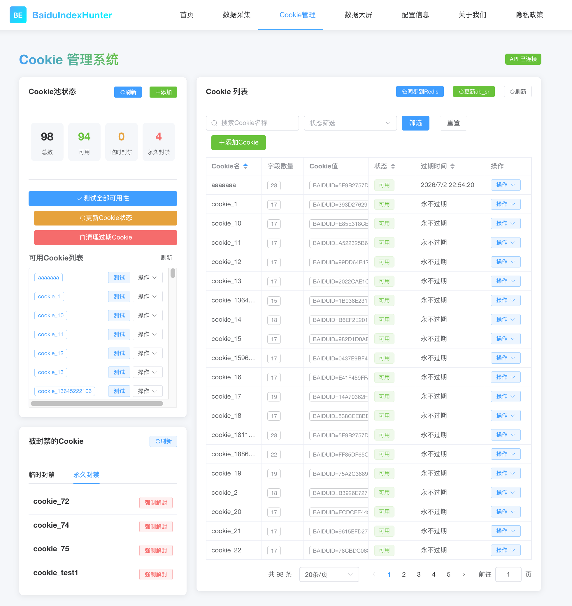
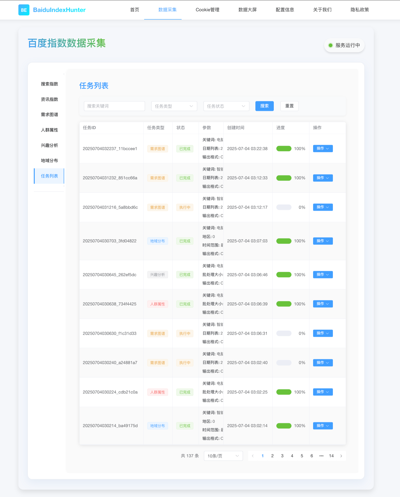
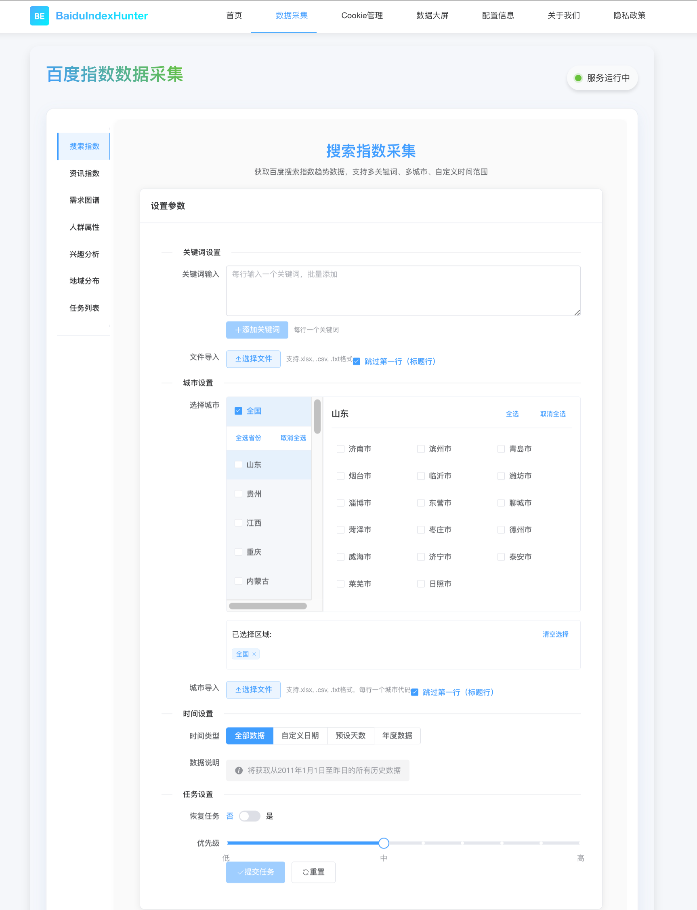
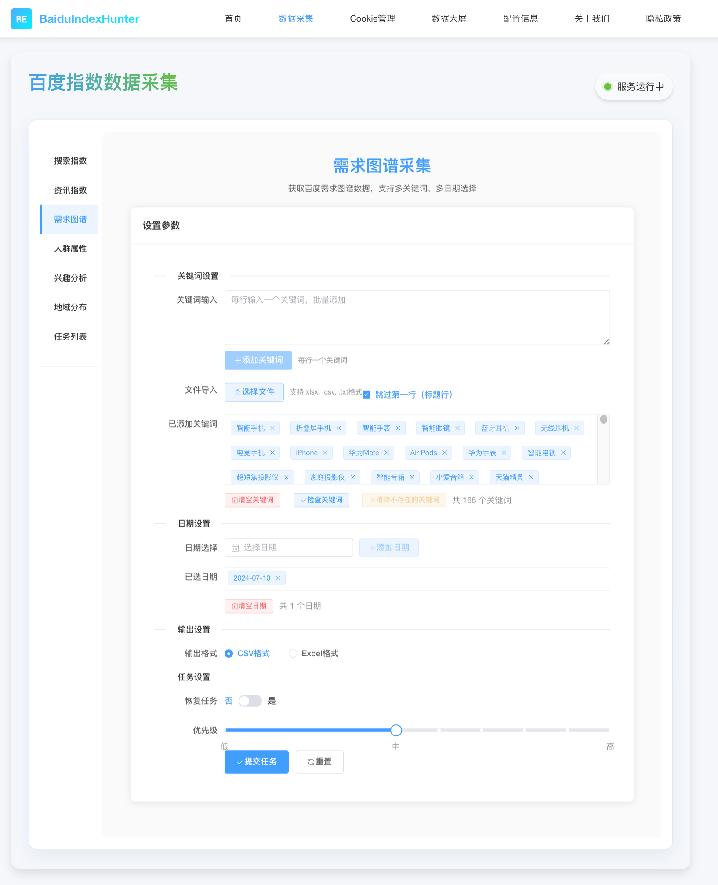
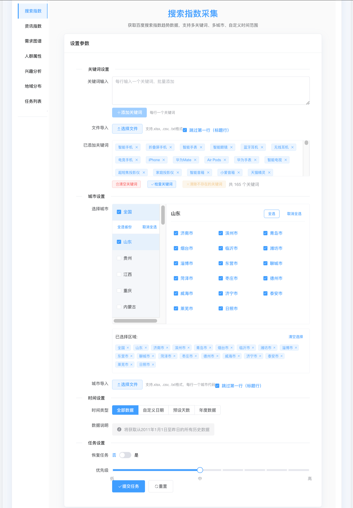
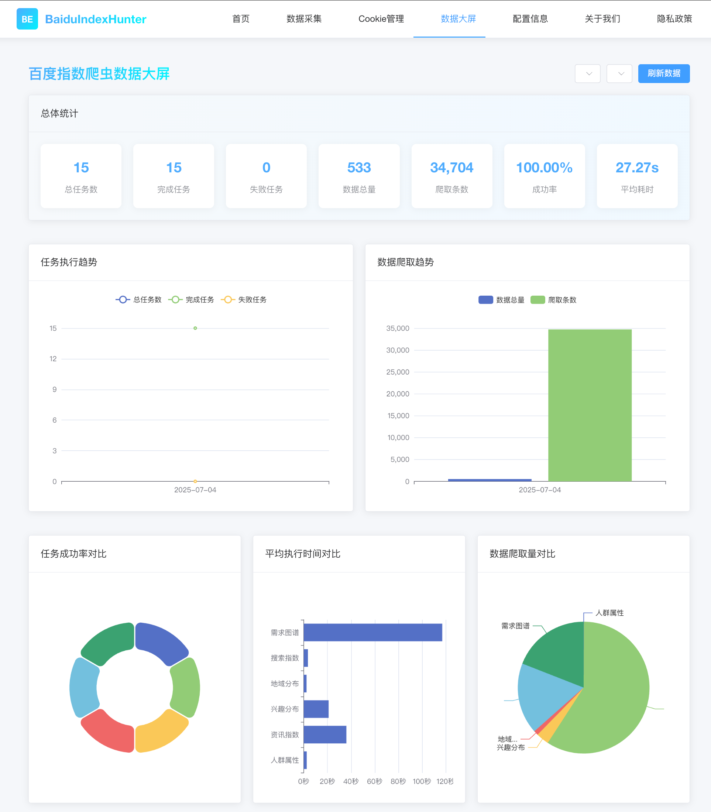
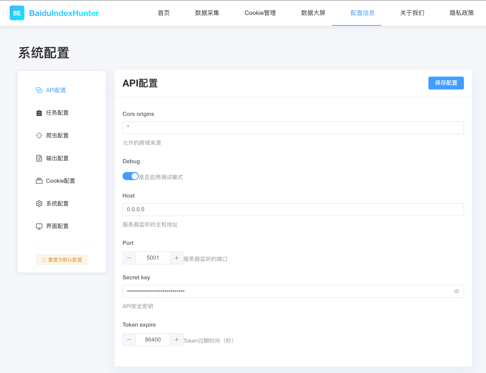
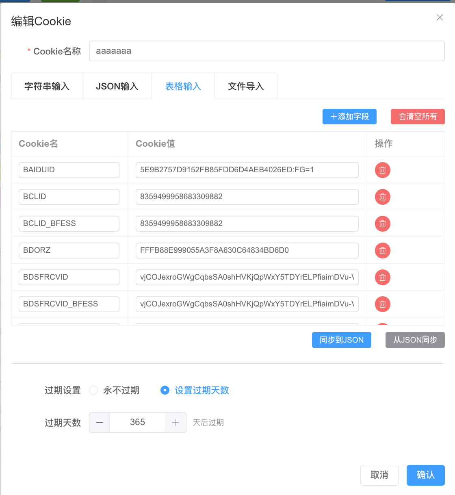
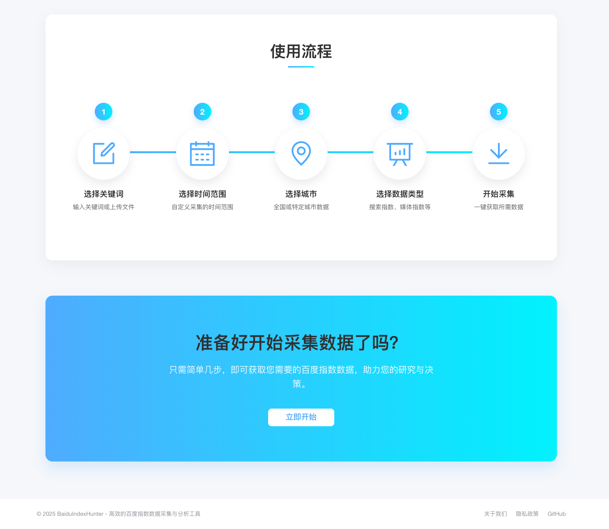

# BaiduIndexHunter

**BaiduIndexHunter** 是一个功能强大的百度指数爬虫工具集合，专注于收集百度指数的六大模块数据：**搜索指数**、**资讯指数**、**需求图谱**、**人群属性**、**兴趣分布** 和 **地域分布**。该项目采用模块化设计，支持多用户并发请求，提供实时任务状态更新和友好的用户体验。通过现代化的技术栈和高效的任务管理机制，BaiduIndexHunter 适用于个人研究、企业数据分析等多种场景。

---

## 目录

- [项目概述](#项目概述)
- [功能特性](#功能特性)
- [界面展示](#界面展示)
- [爬虫模块](#爬虫模块)
  - [1. 搜索指数爬虫](#1-搜索指数爬虫)
  - [2. 资讯指数爬虫](#2-资讯指数爬虫)
  - [3. 需求图谱爬虫](#3-需求图谱爬虫)
  - [4. 人群属性爬虫](#4-人群属性爬虫)
  - [5. 兴趣分布爬虫](#5-兴趣分布爬虫)
  - [6. 地域分布爬虫](#6-地域分布爬虫)
- [技术栈](#技术栈)
- [安装与配置](#安装与配置)
- [使用示例](#使用示例)
- [数据输出格式](#数据输出格式)
- [任务管理](#任务管理)
- [贡献指南](#贡献指南)
- [许可证](#许可证)

---

## 项目概述

BaiduIndexHunter 通过模拟浏览器请求百度指数 API，获取各类指数数据，并采用 Cookie 轮换机制和反爬策略确保爬取稳定性。系统支持灵活的参数配置（如关键词、城市、日期范围等），并提供断点续爬、自动保存等功能。前后端分离的架构设计，使得任务管理和数据展示分离，提升了系统的可扩展性和用户体验。

---

## 功能特性

- **多模块支持**：覆盖百度指数六大核心模块，满足多样化数据需求。
- **并发任务处理**：支持多用户同时提交任务，通过任务队列高效调度。
- **实时状态反馈**：通过 WebSocket 提供任务进度和状态的实时更新。
- **断点续爬**：任务中断后可从检查点恢复，避免数据丢失。
- **灵活输入**：支持关键词列表、文件导入、自定义日期范围等多种方式。
- **数据可视化**：前端集成图表展示，便于分析爬取结果。
- **反爬策略**：内置 Cookie 池、随机 User-Agent 和请求间隔控制，确保爬取稳定。

---

## 界面展示

以下是 BaiduIndexHunter 的界面截图，展示了系统的核心功能和用户体验：

- **首页**  
  

- **Cookie 池管理**  
  

- **任务列表**  
  

- **搜索指数采集**  
  

- **需求图谱批量采集**  
  

- **批量采集和关键词读取**  
  

- **数据大屏**  
  

- **系统配置界面**  
  

- **Cookie 的 CRUD**  
  

- **使用流程**  
  

这些截图展示了系统的操作界面、任务管理、数据采集和结果展示功能，帮助用户快速了解 BaiduIndexHunter 的使用方式。

---

## 爬虫模块

### 1. 搜索指数爬虫

- **功能**：抓取百度搜索指数的日度、周度趋势及统计数据。
- **API URL**：`https://index.baidu.com/api/SearchApi/index`
- **爬取内容**：
  - 日度/周度搜索指数（PC 端、移动端、总体）
  - 统计数据（日均值、同比、环比等）
- **文件路径**：`spider/search_index_crawler.py`

### 2. 资讯指数爬虫

- **功能**：获取百度资讯指数的趋势数据。
- **API URL**：`https://index.baidu.com/api/FeedSearchApi/getFeedIndex`
- **爬取内容**：
  - 日度/周度资讯指数
  - 整体统计数据
- **文件路径**：`spider/feed_index_crawler.py`

### 3. 需求图谱爬虫

- **功能**：提取关键词的关联关系数据。
- **API URL**：`https://index.baidu.com/api/WordGraph/multi`
- **爬取内容**：
  - 相关词及其搜索量、变化率、相关度
- **文件路径**：`spider/word_graph_crawler.py`

### 4. 人群属性爬虫

- **功能**：获取人群属性分布数据（性别、年龄、学历等）。
- **API URL**：`https://index.baidu.com/api/SocialApi/baseAttributes`
- **爬取内容**：
  - 性别比例、年龄分布、学历分布
- **文件路径**：`spider/demographic_attributes_crawler.py`

### 5. 兴趣分布爬虫

- **功能**：提取人群兴趣画像数据。
- **API URL**：`https://index.baidu.com/api/SocialApi/interest`
- **爬取内容**：
  - 兴趣类别及其比例
- **文件路径**：`spider/interest_profile_crawler.py`

### 6. 地域分布爬虫

- **功能**：获取地域分布的搜索指数数据。
- **API URL**：`https://index.baidu.com/api/SearchApi/region`
- **爬取内容**：
  - 各省市地区的搜索指数比例
- **文件路径**：`spider/region_distribution_crawler.py`

---

## 技术栈

### 后端
- **FastAPI**：高性能 Web API 框架，支持异步处理。
- **Celery**：分布式任务调度框架，用于任务管理。
- **Redis**：任务队列和缓存，支持优先级管理和快速查询。
- **MySQL**：关系型数据库，存储任务元数据和爬取结果。
- **Python**：核心编程语言，版本 3.8+。
- **aiohttp**：异步 HTTP 请求库，提升爬取效率。
- **ThreadPoolExecutor**：多线程并发处理任务。

### 前端
- **Vue.js**：轻量级前端框架，构建交互式界面。
- **WebSocket**：实时通信，推送任务状态。
- **Chart.js**：数据可视化库，展示指数趋势图。

### 部署与工具
- **Docker**：容器化部署，确保环境一致性。
- **Nginx**：反向代理和静态文件服务。

---

## 安装与配置

### 1. 克隆仓库
```bash
git clone https://github.com/yourusername/BaiduIndexHunter.git
cd BaiduIndexHunter
```

### 2. 安装依赖
```bash
pip install -r requirements.txt
```

### 3. 配置环境变量
在项目根目录创建 `.env` 文件，配置以下变量：
```
REDIS_URL=redis://localhost:6379/0
MYSQL_HOST=localhost
MYSQL_USER=root
MYSQL_PASSWORD=yourpassword
MYSQL_DB=baidu_index
API_PORT=8000
```

### 4. 启动服务
使用 Docker Compose 启动所有组件：
```bash
docker-compose up -d
```

---

## 使用示例

### 1. 爬取搜索指数
```python
from spider.search_index_crawler import search_index_crawler

# 基本用法：爬取最近30天数据
keywords = ["电脑"]
search_index_crawler.crawl(keywords=keywords)

# 综合示例：指定城市和日期范围
keywords = ["电脑", "手机"]
cities = {0: "全国", 514: "北京"}
date_ranges = [("2023-01-01", "2023-12-31")]
search_index_crawler.crawl(keywords=keywords, cities=cities, date_ranges=date_ranges)
```

### 2. 恢复中断任务
```python
task_id = "20240101123456"
search_index_crawler.resume_task(task_id)
```

### 3. 查看任务列表
```python
tasks = search_index_crawler.list_tasks()
for task in tasks:
    print(f"任务ID: {task['task_id']}, 进度: {task['progress']}%")
```

### 4. 从文件加载关键词
```python
search_index_crawler.crawl(
    keywords_file="data/keywords.txt",
    cities_file="data/cities.csv",
    days=90
)
```

---

## 数据输出格式

数据文件存储在 `output/` 目录下，按模块和任务 ID 组织：

- **搜索指数**：
  - `output/search_index/{task_id}_daily_data.csv`：日度/周度数据
  - `output/search_index/{task_id}_stats_data.csv`：统计数据
- **资讯指数**：
  - `output/feed_index/{task_id}_daily_data.csv`
  - `output/feed_index/{task_id}_stats_data.csv`
- **需求图谱**：
  - `output/word_graph/{task_id}_word_graph.csv`
- **人群属性**：
  - `output/demographic_attributes/{task_id}_demographic_attributes.csv`
- **兴趣分布**：
  - `output/interest_profiles/{task_id}_interest_profiles.csv`
- **地域分布**：
  - `output/region_distributions/{task_id}_region_distributions.csv`

检查点文件存储在 `output/checkpoints/{task_id}_checkpoint.pkl`，用于任务恢复。

---

## 任务管理

- **创建任务**：调用 `crawl()` 方法提交新任务。
- **恢复任务**：通过 `resume_task(task_id)` 恢复中断任务。
- **查看状态**：使用 `get_task_status(task_id)` 获取任务进度。
- **任务列表**：调用 `list_tasks()` 查看所有任务状态。

任务 ID 格式为 `YYYYMMDDHHmmss`，自动生成。

---

## 贡献指南

欢迎为 BaiduIndexHunter 贡献代码！请按照以下步骤操作：
1. Fork 本仓库。
2. 创建新分支：`git checkout -b feature/your-feature-name`。
3. 提交更改：`git commit -m "Add your feature"`。
4. 推送分支：`git push origin feature/your-feature-name`。
5. 创建 Pull Request。

详情请参考 [CONTRIBUTING.md](CONTRIBUTING.md)。

---

## 许可证

本项目采用 [MIT 许可证](LICENSE)，允许自由使用、修改和分发。

---