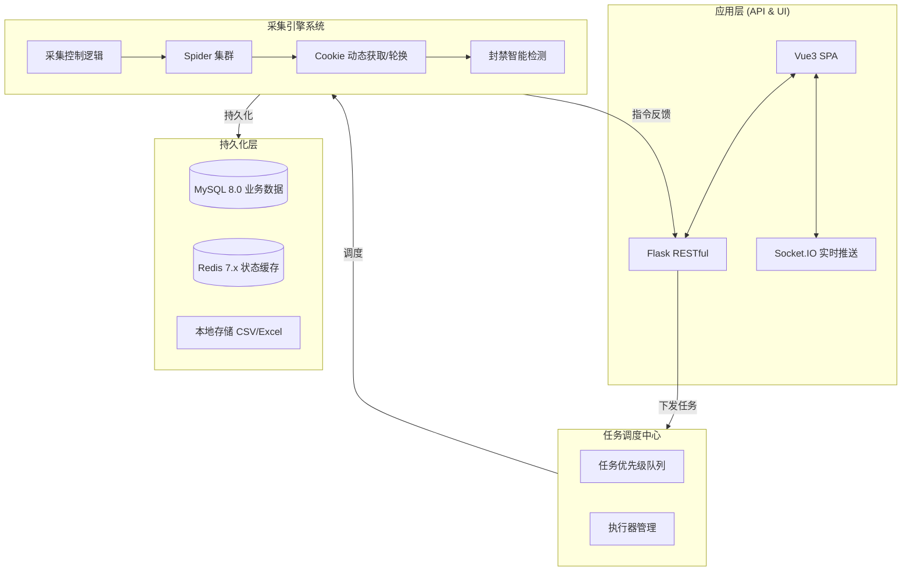
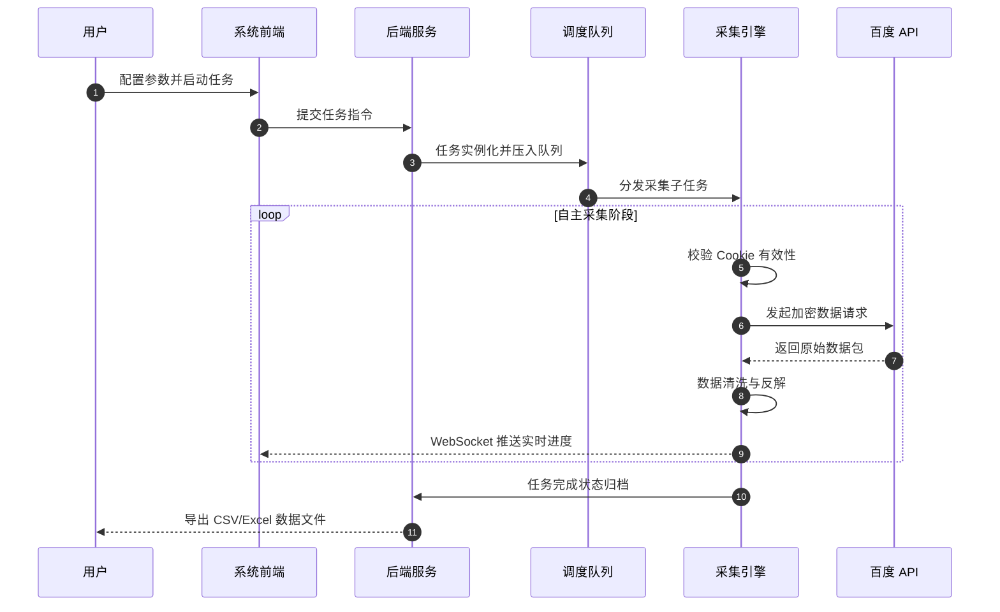

<div align="center">
  <div style="display: flex; justify-content: center; align-items: center; gap: 2.5rem; flex-wrap: wrap;">
    <div style="display: flex; flex-direction: column; align-items: flex-start; min-width: 320px;">
      <h1 style="margin-bottom: 0.5em;">
        
        BaiduIndexHunter
      </h1>
      <h3 style="margin-top:0;">专业的百度指数采集与分析平台</h3>
    </div>
    <div>
      
    </div>
  </div>
</div>

<p align="center">
  <a href="./README.md">🇨🇳 简体中文</a> | <a href="./README_EN.md">🇺🇸 English</a>
</p>
<p align="center">
  <!-- 技术栈、版本、License、PR、Fork、Watch、Star、Issue、Last Commit —— 所有徽章聚合到同一行 -->
  
  
  
  
  
  
  
  
  
  
  
  
  
</p>


---

## 📺 演示视频

<p align="center">
  <video src="https://github.com/Auroral0810/BaiduIndexHunter/raw/main/static/github演示视频.mp4" controls autoplay muted loop width="95%" poster="static/首页-门面.png">
    您的浏览器不支持 HTML5 视频播放，请 <a href="static/github演示视频.mp4">点击此处下载</a> 观看。
  </video>
</p>

---

## ⚠️ 免责声明

> **本项目仅供学习交流使用，严禁用于任何商业用途。**
> 使用者需遵守相关法律法规，因使用本项目而产生的任何法律责任由使用者自行承担。

---

## 📖 目录

- [项目简介](#-项目简介)
- [功能特性](#-功能特性)
- [系统架构](#-系统架构)
- [技术栈](#-技术栈)
- [界面展示](#-界面展示)
- [快速开始](#-快速开始)
- [使用示例](#-使用示例)
- [环境要求](#-环境要求)
- [联系作者](#-联系作者)

---

## 🎯 项目简介

**BaiduIndexHunter 2.0** 是一套工业级的百度指数全量采集解决方案。
项目采用 **Flask + Vue3 + Element Plus** 构建，集成了分布式任务调度、实时状态推送、智能反爬池、数据可视化大屏等核心模块。

✅ **核心价值**：解决手动记录指数数据低效、易错、难以长期追踪的痛点，为学术研究与职场数据分析赋能。

---

## ✨ 功能特性

<div align="center">

| 🏷️ **核心能力**       | 📝 **详细描述**                                                                                    |
| :-------------------- | :------------------------------------------------------------------------------------------------- |
| 🔍 **六大模块全覆盖** | 深度集成 **搜索指数**、**资讯指数**、**需求图谱**、**人群属性**、**兴趣分布**、**地域分布** 接口。 |
| 📊 **实时状态监控**   | 基于 **WebSocket** 技术，秒级同步采集进度与系统日志，实时监控项目运行状态。                        |
| ⚡ **高效并发采集**   | 采用分布式消息队列设计，支持多任务同时运行，轻松应对海量关键词采集需求。                           |
| 🍪 **智能账号池**     | 内置账号状态自动巡检机，支持 Cookie **自动轮换**、封禁预警与用量可视化统计。                       |
| 🔄 **任务断点续存**   | 支持任务检查点（Checkpoint）机制，意外中断后可一键恢复，杜绝重复流量消耗。                         |
| 📤 **结构化数据导出** | 自动将采集结果清洗为 **CSV / Excel / Parquet** 格式，并提供结构化数据库存储支持。                  |
| 🌐 **多语言与国际化** | 完整支持 **中/英 双语** 界面切换，适应多语言工作环境。                                             |
| 🌙 **深色模式支持**   | 适配现代 IDE 审美，支持 **Dark Mode** 一键切换，保护长时间工作下的视觉疲劳。                       |

</div>

---

## 🏗️ 系统架构

### 核心处理逻辑



### 数据流转流程



---

## 📸 界面展示

### 🏛️ 首页控制台

<div align="center">
  
  
</div>

### 📊 数据大屏可视化

<div align="center">
  
  <br />
  
  
</div>

### 🕷️ 任务与 Cookie 管理

<div align="center">
  
  
</div>

---

## 🚀 快速开始

### 1. 基础环境

确保安装了 **Python 3.11**、**Node.js 18**、**MySQL 8** 和 **Redis 7**。

### 2. 后端部署

```bash
# 进入后端目录
cd baidu-index-hunter-backend
# 安装依赖
pip install -r requirements.txt
# 配置 .env (参考 .env.example)
python app.py
```

### 3. 前端部署

```bash
# 进入前端目录
cd baidu-index-hunter-frontend
# 安装并运行
npm install && npm run dev
```

---

## 💻 环境要求

| 软件        | 最低要求 | 推荐版本 |
| :---------- | :------- | :------- |
| **Python**  | 3.11.0   | 3.11.13  |
| **Node.js** | 18.0.0   | 18.20.x  |
| **MySQL**   | 8.0.0    | 8.0.36   |
| **Redis**   | 7.0.0    | 7.2.x    |

---

## 📄 许可证

本项目采用 **EULA 非商业许可协议**。

---

## 📞 联系作者

<table align="center">
  <tr>
    <td align="center"><b>微信 (WeChat)</b></td>
    <td align="center"><b>QQ (Group)</b></td>
  </tr>
  <tr>
    <td align="center"></td>
    <td align="center"></td>
  </tr>
  <tr>
    <td align="center">扫码添加作者</td>
    <td align="center">QQ: 1957689514</td>
  </tr>
</table>

<p align="center">
  📧 <strong>Email:</strong> <a href="mailto:15968588744@163.com">15968588744@163.com</a>
</p>

---

<p align="center">
  <b>如果这个项目对你有帮助，请点击右上角给一个 ⭐ Star 支持一下！感谢！</b>
</p>
