<table align="center" border="0">
  <tr>
    <td width="45%" align="center">
      
      <h1>🎯 BaiduIndexHunter 2.0</h1>
      <p><strong>专业的百度指数采集与分析平台</strong></p>
    </td>
    <td width="55%">
      
    </td>
  </tr>
</table>

<p align="center">
  <a href="./README.md">🇨🇳 简体中文</a> | <a href="./README_EN.md">🇺🇸 English</a>
</p>

<p align="center">
  
  
  
  
  
</p>

<p align="center">
  
  
  
  
  
</p>

---

## 📺 演示视频

<p align="center">
  <video src="https://github.com/Auroral0810/BaiduIndexHunter/raw/main/static/github演示视频.mp4" controls autoplay muted loop width="90%">
    您的浏览器不支持视频播放，请<a href="static/github演示视频.mp4">点击此处下载</a>观看。
  </video>
</p>

---

## ⚠️ 免责声明

> **本项目仅供学习交流使用，严禁用于任何商业用途。**
> 使用者需遵守相关法律法规，因使用本项目而产生的任何法律责任由使用者自行承担。

---

## 📖 目录

- [项目简介](#-项目简介)
- [功能特性](#-功能特性)
- [系统架构](#-系统架构)
- [技术栈](#-技术栈)
- [界面展示](#-界面展示)
- [快速开始](#-快速开始)
- [使用示例](#-使用示例)
- [爬虫模块](#-爬虫模块)
- [环境要求](#-环境要求)
- [贡献指南](#-贡献指南)
- [许可证](#-许可证)
- [联系作者](#-联系作者)
- [Star 历史](#-star-历史)

---

## 🎯 项目简介

**BaiduIndexHunter 2.0** 是一个全功能的百度指数采集与分析系统，旨在帮助用户高效获取百度搜索、资讯、人群画像等核心数据。

系统采用现代化的 **前后端分离架构**，支持：

- 🚀 多用户并发任务
- 📊 实时状态监控与数据可视化大屏
- 🔐 强大的 Cookie 池管理
- 🔄 断点续传与自动恢复
- 🌍 多语言国际化支持

---

## ✨ 功能特性

<div align="center">

|     🔍 **六大模块全覆盖**      | ⚡ **高效并发采集** | 📊 **实时状态监控** | 🍪 **智能 Cookie 管理** |
| :----------------------------: | :-----------------: | :-----------------: | :---------------------: |
| 搜索指数 · 资讯指数 · 需求图谱 |   分布式任务队列    | WebSocket 实时推送  |   自动轮换 · 封禁检测   |
| 人群属性 · 兴趣分布 · 地域分布 |   多用户同时采集    |   数据大屏可视化    |     用量统计可视化      |

| 🔄 **断点续传**  | 📤 **灵活数据导出** | 🌐 **国际化多语言**  | 🌙 **深色模式** |
| :--------------: | :-----------------: | :------------------: | :-------------: |
| 任务中断自动恢复 |  CSV / Excel 格式   | 中文 / 英文 界面切换 |  护眼深色主题   |
|   检查点持久化   |   自动持久化存储    |     一键切换语言     |  一键切换主题   |

</div>

---

## 🏗️ 系统架构

### 整体架构图

```mermaid
flowchart TB
    subgraph Client["🖥️ 客户端"]
        Browser["浏览器"]
    end

    subgraph Frontend["🎨 前端 Vue.js 3"]
        direction LR
        UI["Element Plus UI"]
        Charts["ECharts 图表"]
        WS_C["WebSocket"]
    end

    subgraph Backend["⚙️ 后端 Flask"]
        direction LR
        API["RESTful API"]
        WS_S["Socket.IO"]
        Scheduler["APScheduler"]
    end

    subgraph Crawler["🕷️ 爬虫引擎"]
        direction TB
        C1["搜索指数"]
        C2["资讯指数"]
        C3["地域分布"]
        C4["人群属性"]
        C5["需求图谱"]
        C6["兴趣分布"]
    end

    subgraph Storage["💾 数据存储"]
        direction LR
        MySQL[("MySQL")]
        Redis[("Redis")]
        Files["CSV/Excel"]
    end

    Browser --> Frontend
    Frontend <--> Backend
    Backend --> Crawler
    Crawler --> Storage
    Backend <--> Storage
```



### 爬虫任务流程图

```mermaid
flowchart LR
    A([🧑 用户]) -->|1. 创建任务| B[📱 前端]
    B -->|2. POST /api/tasks| C[⚙️ 后端]
    C -->|3. 保存任务| D[(💾 数据库)]
    C -->|4. 加入队列| E[📋 任务队列]
    E -->|5. 分发任务| F[🕷️ 爬虫引擎]
    F -->|6. 请求数据| G[🌐 百度 API]
    G -->|7. 返回数据| F
    F -->|8. 存储结果| D
    F -.->|9. 推送进度| B
    B -.->|10. 显示结果| A

    style A fill:#e1f5fe
    style B fill:#fff3e0
    style C fill:#f3e5f5
    style D fill:#e8f5e9
    style E fill:#fce4ec
    style F fill:#fff8e1
    style G fill:#e3f2fd
```



---

## 🛠️ 技术栈

### 后端技术

|                                                       技术                                                       | 版本  | 说明              |
| :--------------------------------------------------------------------------------------------------------------: | :---: | :---------------- |
|              | 3.11+ | 核心编程语言      |
|                 | 3.1.2 | Web API 框架      |
|  |  2.0  | ORM 框架 (连接池) |
|                 |  7.x  | 缓存与消息队列    |
|                 |  8.0  | 关系型数据库      |
|        |  4.x  | 浏览器自动化      |
|     |  5.x  | 实时通信          |

### 前端技术

|                                                        技术                                                         | 版本 | 说明                  |
| :-----------------------------------------------------------------------------------------------------------------: | :--: | :-------------------- |
|                 | 3.4  | 前端框架 (组合式 API) |
|                       | 5.1  | 构建工具              |
|  | 2.4  | UI 组件库             |
|                   | 2.x  | 状态管理              |
|       | 5.6  | 数据可视化            |
|                    | 1.6  | HTTP 客户端           |

---

## 📸 界面展示

### 🏠 首页

<table>
  <tr>
    <td></td>
    <td></td>
  </tr>
  <tr>
    <td></td>
    <td></td>
  </tr>
</table>

### 📊 数据大屏

<table>
  <tr>
    <td colspan="2"></td>
  </tr>
  <tr>
    <td></td>
    <td></td>
  </tr>
</table>

### 🕷️ 数据采集

<table>
  <tr>
    <td></td>
    <td></td>
  </tr>
</table>

### 🍪 Cookie 管理

<table>
  <tr>
    <td></td>
    <td></td>
  </tr>
</table>

### ⚙️ 系统设置

<table>
  <tr>
    <td></td>
    <td></td>
  </tr>
  <tr>
    <td></td>
    <td></td>
  </tr>
</table>

### ℹ️ 关于页面

<table>
  <tr>
    <td></td>
    <td></td>
  </tr>
</table>

---

## 🚀 快速开始

### 1. 克隆仓库

```bash
git clone https://github.com/Auroral0810/BaiduIndexHunter.git
cd BaiduIndexHunter
```

### 2. 后端配置

```bash
cd baidu-index-hunter-backend

# 创建虚拟环境
python -m venv venv
source venv/bin/activate  # Windows: venv\Scripts\activate

# 安装依赖
pip install -r requirements.txt

# 配置环境变量
cp config/.env.example config/.env
# 编辑 config/.env 填写数据库等配置

# 初始化数据库
mysql -u root -p < scripts/BaiduIndexHunter.sql

# 启动后端服务
python app.py
```

### 3. 前端配置

```bash
cd baidu-index-hunter-frontend

# 安装依赖
npm install

# 启动开发服务器
npm run dev

# 生产环境构建
npm run build
```

### 4. 访问系统

- 前端地址: `http://localhost:5173`
- 后端 API: `http://localhost:5001`
- API 文档: `http://localhost:5001/apidocs`

---

## 📈 使用示例

### 数据输出示例

#### 日度数据


#### 年度数据


### 输出文件格式

```
output/
├── search_index/           # 搜索指数
│   ├── {task_id}_daily.csv
│   └── {task_id}_stats.csv
├── feed_index/             # 资讯指数
├── word_graph/             # 需求图谱
├── demographic/            # 人群属性
├── interest/               # 兴趣分布
├── region/                 # 地域分布
└── checkpoints/            # 断点文件
```

---

## 🕷️ 爬虫模块

|      模块       | 功能                        | API 端点                          |
| :-------------: | :-------------------------- | :-------------------------------- |
| 🔍 **搜索指数** | 日度/周度搜索趋势、统计数据 | `/api/SearchApi/index`            |
| 📰 **资讯指数** | 日度/周度资讯趋势           | `/api/FeedSearchApi/getFeedIndex` |
| 🗺️ **需求图谱** | 关键词关联关系              | `/api/WordGraph/multi`            |
| 👥 **人群属性** | 性别、年龄、学历分布        | `/api/SocialApi/baseAttributes`   |
| 💡 **兴趣分布** | 人群兴趣画像                | `/api/SocialApi/interest`         |
| 📍 **地域分布** | 各省市搜索指数              | `/api/SearchApi/region`           |

---

## 💻 环境要求

|     软件     |                最低版本                 |   推荐版本    |
| :----------: | :-------------------------------------: | :-----------: |
| **操作系统** | Windows 10 / macOS 10.15 / Ubuntu 20.04 |  最新稳定版   |
|  **Python**  |                 3.11.0                  |    3.11.13    |
| **Node.js**  |                 18.0.0                  | 18.20.8 (LTS) |
|  **MySQL**   |                  8.0.0                  |    8.0.36     |
|  **Redis**   |                  7.0.0                  |     7.2.7     |
|  **Chrome**  |                 最新版                  |    最新版     |

> ⚠️ **注意**: Python 必须使用 3.11.x 版本，暂不支持 3.12+

---

## 🤝 贡献指南

我们欢迎任何形式的贡献！请查阅 [CONTRIBUTING.md](CONTRIBUTING.md) 了解详情。

1. 🍴 Fork 本仓库
2. 🔨 创建特性分支 (`git checkout -b feature/AmazingFeature`)
3. 📝 提交更改 (`git commit -m 'Add some AmazingFeature'`)
4. 📤 推送分支 (`git push origin feature/AmazingFeature`)
5. 🎉 创建 Pull Request

---

## 📄 许可证

本项目采用 **EULA 非商业许可协议**。

- ✅ 允许个人学习和学术研究
- ✅ 允许非商业目的的技术交流
- ❌ 禁止任何商业用途

详情请查阅 [LICENSE](LICENSE) 文件。

---

## 📞 联系作者

如有任何问题或建议，欢迎通过以下方式联系：

<table align="center">
  <tr>
    <td align="center">
      <strong>📧 邮箱</strong><br>
      <a href="mailto:15968588744@163.com">15968588744@163.com</a>
    </td>
    <td align="center">
      <strong>💬 QQ</strong><br>
      1957689514<br>
      
    </td>
    <td align="center">
      <strong>💚 微信</strong><br>
      扫码添加<br>
      
    </td>
  </tr>
</table>

---

## ⭐ Star 历史

<p align="center">
  <a href="https://star-history.com/#Auroral0810/BaiduIndexHunter&Date">
    
  </a>
</p>

---

<p align="center">
  <strong>如果这个项目对你有帮助，请给一个 ⭐ Star 支持一下！</strong>
</p>

<p align="center">
  Made with ❤️ by <a href="https://github.com/Auroral0810">Auroral0810</a>
</p>
