<p align="center">
  
</p>
<p align="center">
  <a href="./README.md">中文文档</a> | <a href="./README_EN.md">English</a>
</p>
<p align="center">
  <!-- Tech stack, version, license, PR, Fork, Watch, Star, Issue, Last Commit badges -->
  
  
  
  
  
  
  
  
  
  
  
  
  
</p>

---

> [!IMPORTANT]
>
> This project is for **learning and technical exchange only**, and it is `<span style="color: #e53935; font-weight:600;">`strictly prohibited to use it for any commercial purposes or illegal activities!`</span>`
>
> 1. Users must comply with the laws and regulations of their respective countries and regions. **Any consequences resulting from violation of policies, regulations, or others' rights shall be the sole responsibility of the user.**
> 2. The author assumes no legal responsibility for any direct or indirect losses, legal liabilities, or risks arising from this project.
> 3. If you have questions about or cannot accept the terms of the disclaimer, please stop downloading and using this project immediately.
> 4. Please do not reprint or publish the source code and derivative content of this project on other platforms without authorization.

---

## ⚡️ Project Overview

**BaiduIndexHunter** is a comprehensive platform for Baidu Index data collection, storage, and visualization. It adopts a front-end and back-end separation architecture, built on **Flask + Vue 3 + Element Plus**. The system supports data collection across six major dimensions: **Search Index**, **News Index**, **Demand Graph**, **Crowd Attributes**, **Interest Distribution**, and **Regional Distribution**. It integrates core capabilities such as task scheduling, Cookie rotation, breakpoint resume, real-time progress pushing, and a data dashboard.

The project is designed for academic research, market analysis, and public opinion monitoring. It supports batch keyword and multi-region collection, multi-format export (CSV / Excel / Parquet, etc.), and includes built-in security mechanisms such as API authentication and environment validation. It is suitable for deployment by individuals or small teams.

---

## 📺 Demo Video

<p align="center">
  <video src="https://private-user-images.githubusercontent.com/140379943/546603232-70b973f0-141f-4dd8-a4ea-fa026048a263.mp4" controls autoplay muted loop width="95%" poster="static/首页-门面.png">
    Your browser does not support HTML5 video playback. Please <a href="static/github演示视频.mp4">click here to download</a> and watch it.
  </video>
</p>

---

## ✨ Features

<div align="center">

| Core Capability | Detailed Description |
| :--- | :--- |
| Six Major Modules Coverage | Deep integration of Search Index, News Index, Demand Graph, Crowd Attributes, Interest Distribution, and Regional Distribution data interfaces. |
| Real-time Monitoring | Based on WebSocket technology, synchronizing collection progress and system logs in seconds, and monitoring the system operation status in real-time. |
| Efficient Concurrent Collection | Adopts a distributed message queue design, supporting simultaneous multi-task execution to efficiently handle massive keyword collection scenarios. |
| Intelligent Account Pool | Built-in automatic account inspection mechanism, supporting automatic Cookie rotation, ban alerts, and visual usage statistics. |
| Task Breakpoint Resume | Supports task Checkpoint mechanism, allowing one-click recovery after accidental interruption, eliminating repeated data consumption. |
| Structured Data Export | Collection results are automatically cleaned into six mainstream data structures: CSV / Excel / Parquet / dta / json, and supported for structured database storage. |
| Multi-language & i18n | Full support for switching between nine language interfaces to meet the needs of multi-lingual global users. |
| Dark Mode Support | Adapted to modern IDE aesthetics, supporting one-click switching to Dark Mode to protect visual experience during long working hours. |
| Comprehensive Data Visualization | Built-in rich data analysis and visualization displays to aid in data insight and business decision-making. |

</div>

---

## 🏗️ System Architecture

### Overall Architecture Diagram

<div align="center">
  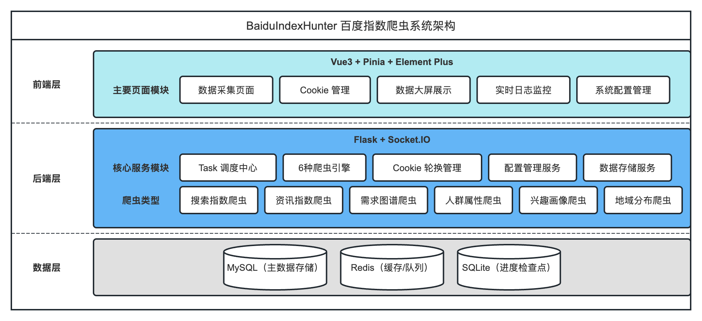
  <br />
  <span style="color: #888; font-size: 15px;">BaiduIndexHunter System Overall Architecture Diagram</span>
</div>

---

### 1️⃣ Home Page

<div align="center">
  
  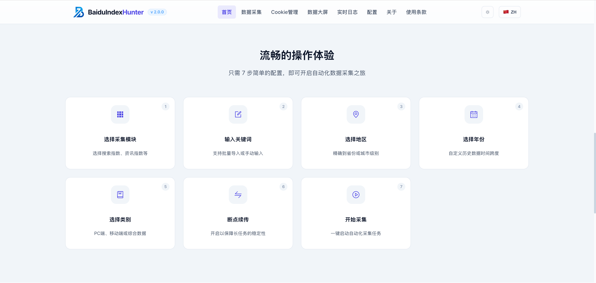
  <br />
  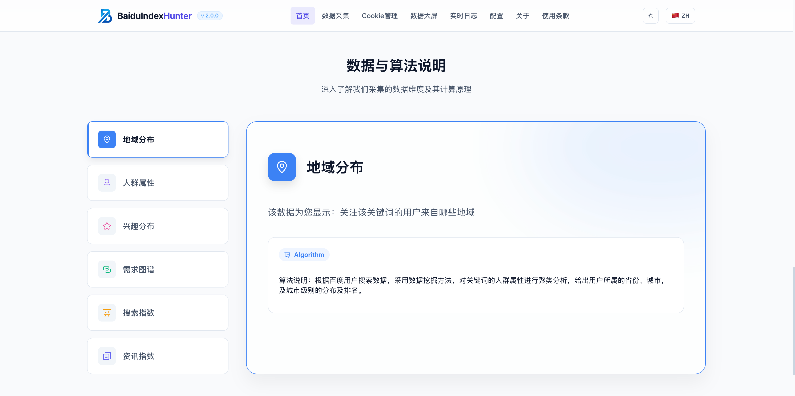
  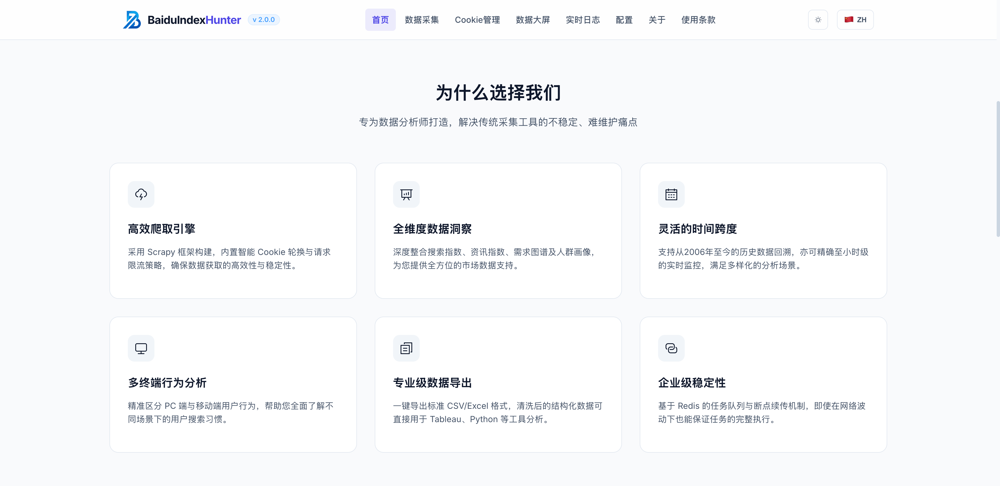
</div>

- Provides product entry, data sources, product advantages display, and guided operation experience and navigation.

---

### 2️⃣ Data Collection Page

<div align="center">
  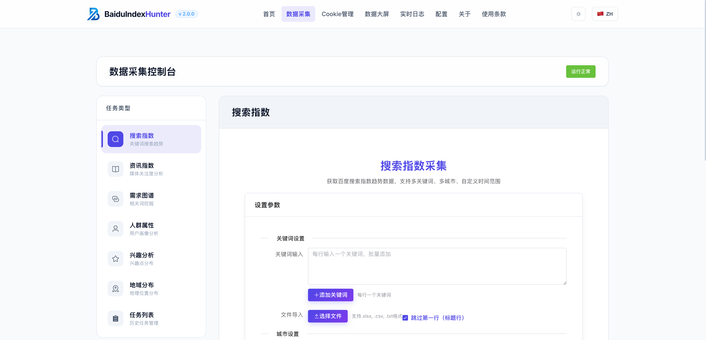
  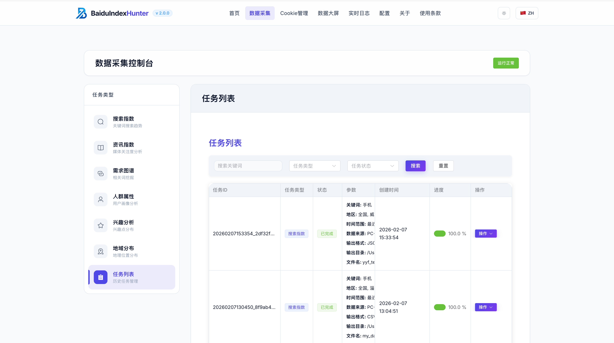
</div>

- Supports batch keyword collection tasks, displaying task list, collection dimensions, real-time collection progress, and instant feedback.

---

### 3️⃣ Cookie Management Page

<div align="center">
  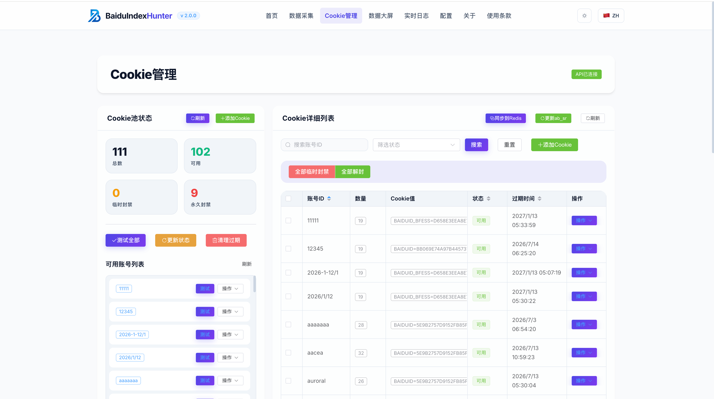
  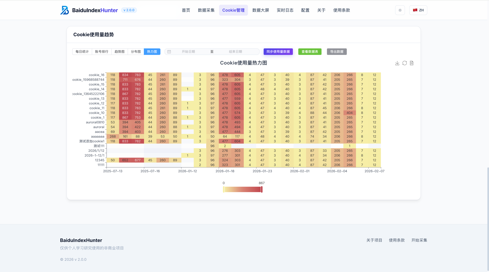
</div>

- Supports account and Cookie import, rotation, and status monitoring, providing usage statistics and status visualization.

---

### 4️⃣ Data Visualization Page

<div align="center">
  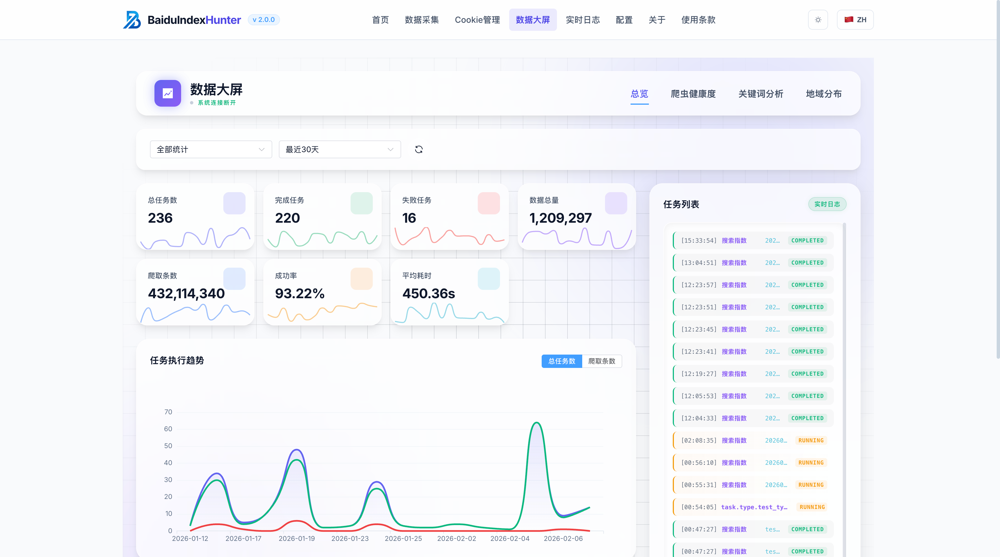
  <br />
  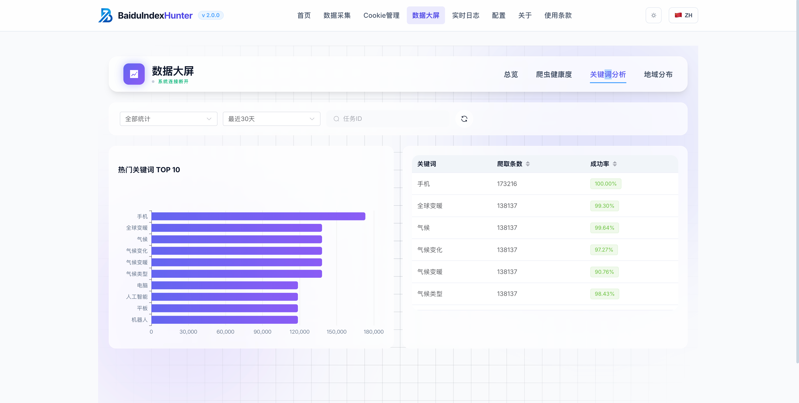
  
</div>

- Multi-dimensional display of collection and analysis results, including visualization panels for keyword analysis, task progress, trend charts, etc.

---

### 5️⃣ Log and Configuration Page

<div align="center">
  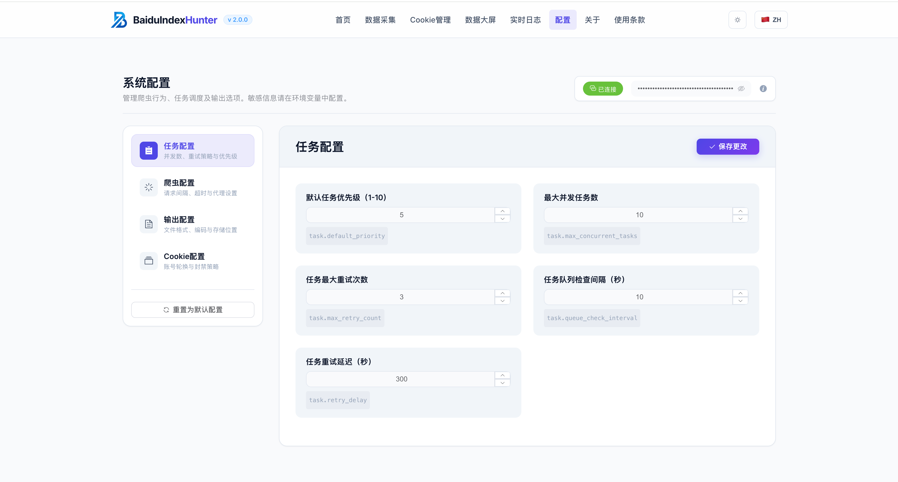
  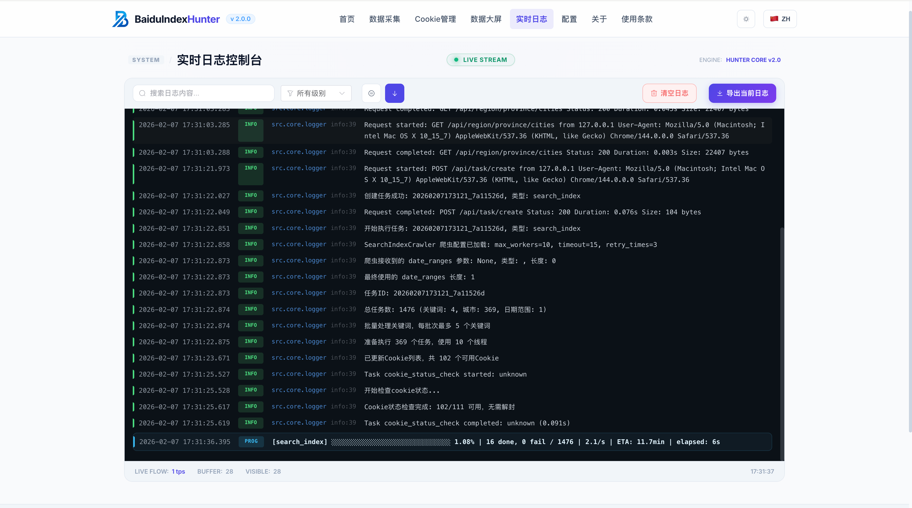
</div>

- System configuration modification, environment information verification, real-time monitoring of collection and system operation logs.

---

### 6️⃣ Themes and Internationalization

<div align="center">
  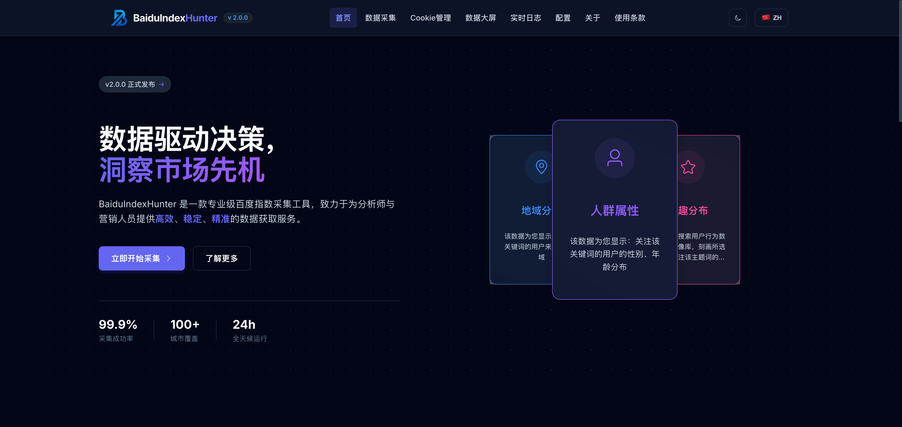
  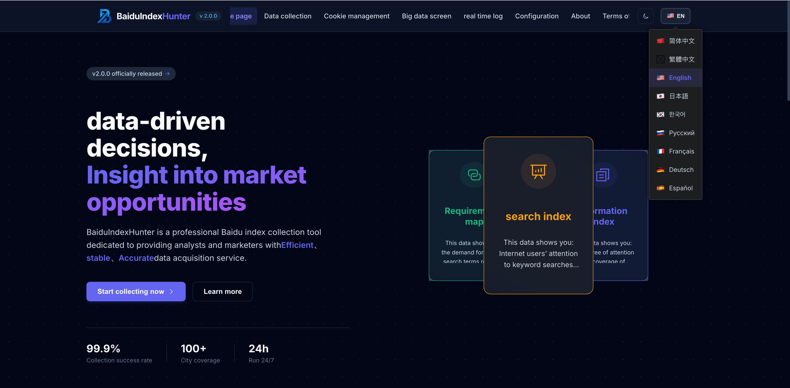
</div>

- One-click switching of dark/light themes, built-in multi-lingual interface, supporting internationalized accessibility experience.

---

### 7️⃣ Collection Data Sample

<div align="center">
  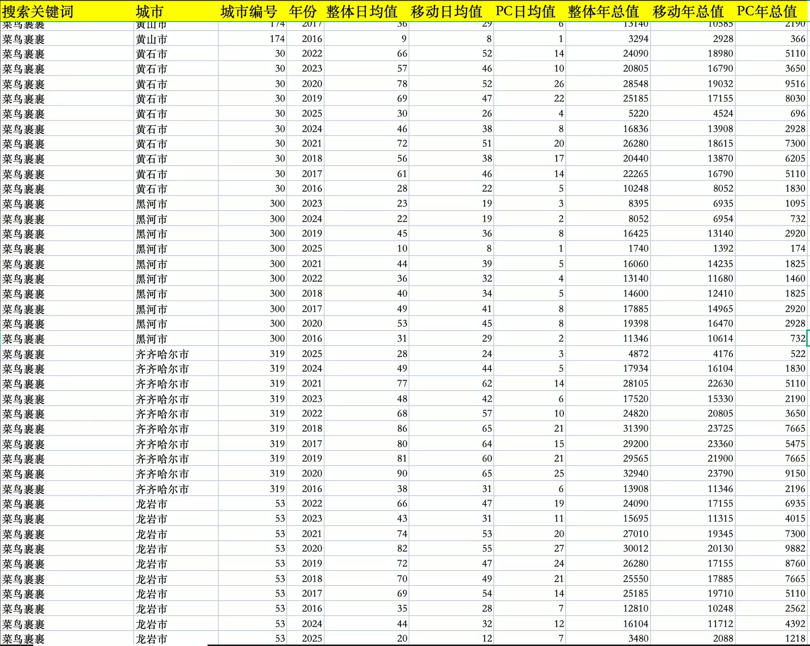
  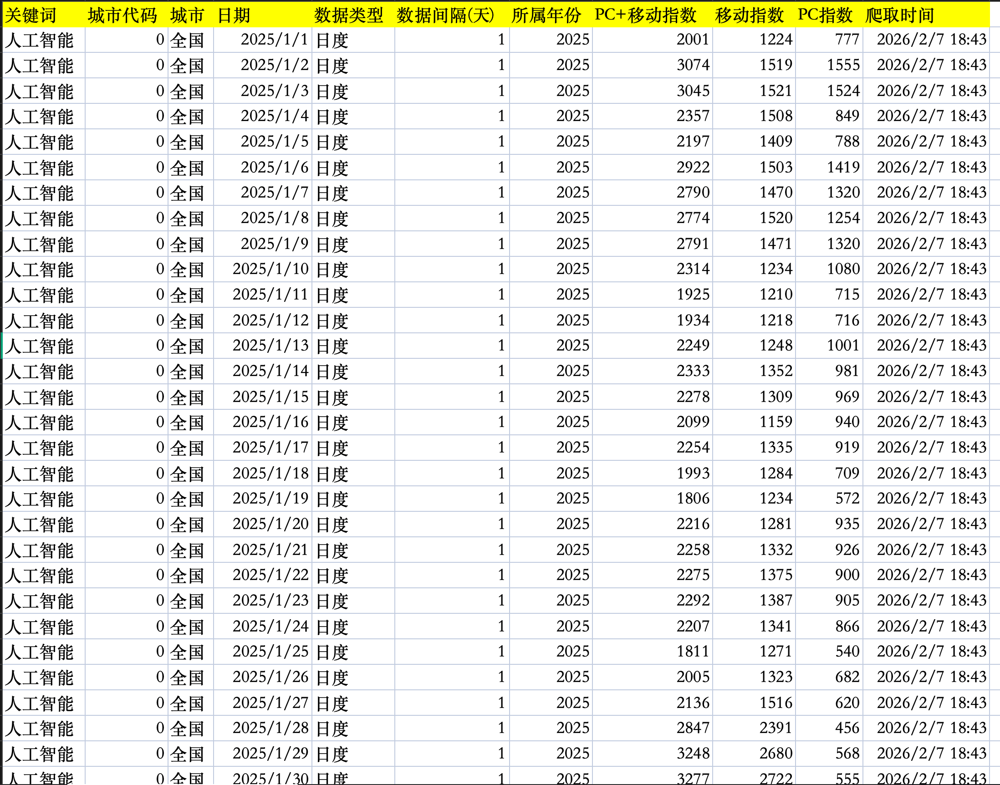
</div>

- Displays data samples of different granularities such as annual and daily to help understand collection and analysis capabilities.

---

## A Complete Collection Process

| Step | Phase Name | Main Operations | Participating Components | Cycle Characteristics |
| :--- | :--- | :--- | :--- | :--- |
| 1 | User Configuration | Front-end selects parameters such as keywords, regions, date range, output format, etc. | DataCollection + SearchIndexTask/FeedIndexTask, etc. | - |
| 2 | Task Submission | User clicks create task, front-end POST /api/task/create | Task components + request.js (Authentication) | - |
| 3 | Interface Reception | Back-end validates request, parses parameters | TaskController + TaskService | - |
| 4 | Parameter Processing | Parses keyword list, city codes, date range, and generates spider parameters | TaskService | - |
| 5 | Task Enqueue | Generates task_id, writes to MySQL, adds to priority queue | TaskScheduler + TaskRepository | - |
| 6 | Response Return | Front-end receives task_id, displays "Task Created" | Front-end + WebSocket Subscription | - |
| 7 | Schedule Dequeue | Background scheduling loop checks queue, takes out tasks to be executed | TaskScheduler | - |
| 8 | Crawler Instantiation | Instantiates corresponding crawler according to task_type (e.g., SearchIndexCrawler) | TaskExecutor | - |
| 9 | Init & Resume | Loads SQLite checkpoints (if any), generates sub-task list, skips completed items | BaseCrawler + ProgressManager | - |
| 10-N | **Loop Phase** | **Concurrent Collection + Progress Reporting** | **Crawler + CookieRotator + WebSocket** | **Multi-round Loop** |
| 10.1 | Get Cookie | Selects available accounts from Cookie pool based on strategy | CookieRotator + CookieService | Per batch/Per sub-task |
| 10.2 | Encrypt Token | Generates request headers such as Cipher-Text | CipherGenerator + execjs | Per sub-task |
| 10.3 | Request Parsing | Requests Baidu Index API, parses JSON response | Processor (search_processor, etc.) | Per sub-task |
| 10.4 | Data Buffering | Appends to memory buffer, writes to CSV in batches when threshold is reached | BaseCrawler + StorageService | Per batch |
| 10.5 | Checkpoint Update | Marks completed/failed, writes to SQLite checkpoint | ProgressManager | Per batch |
| 10.6 | Progress Push | Pushes progress bar, speed, ETA to front-end | WebSocketService + Logs.vue | Per batch |
| N+1 | Data Persistence | Flushes buffer, writes remaining data to CSV | StorageService | - |
| N+2 | Format Conversion | Converts CSV to Excel/DTA/JSON/Parquet/SQLite as configured | StorageService | - |
| N+3 | Task Completion | Updates task status, output path, pushes completion event | TaskRepository + WebSocketService | - |
| N+4 | Front-end Display | Task list displays completion, user can download output file | TaskList + DirPicker | - |

---

## Project Code Structure Tree

> [!IMPORTANT]
> The following structure excludes contents ignored by `.gitignore` such as `node_modules`, `venv`, `logs`, `output`, `.env`, etc.

```
BaiduIndexHunter/
├── baidu-index-hunter-backend/                 # Back-end Flask application
│   ├── app.py                                  # Flask main entry, blueprint registration, WebSocket initialization
│   ├── config/                                 # Configuration directory
│   │   ├── __init__.py
│   │   └── .env.example                        # Environment variable example (MySQL/Redis/API, etc.)
│   ├── scripts/                                # Scripts and SQL
│   │   ├── BaiduIndexHunter.sql                # Database table creation and initialization script
│   │   ├── fix_db_schema.py                    # Database structure fix script
│   │   └── import_region_data.py               # Region data import script
│   ├── src/                                    # Core source code
│   │   ├── api/                                # REST API layer
│   │   │   ├── schemas/                        # Pydantic request/response models
│   │   │   │   ├── base.py                     # Response formatting
│   │   │   │   ├── config.py                   # Configuration related Schema
│   │   │   │   ├── cookie.py                   # Cookie related Schema
│   │   │   │   ├── region.py                   # Region related Schema
│   │   │   │   ├── statistics.py               # Statistics related Schema
│   │   │   │   ├── task.py                     # Task related Schema
│   │   │   │   └── word_check.py               # Keyword check Schema
│   │   │   ├── utils/                          # Swagger documentation, validation tools
│   │   │   └── v1/                             # API v1 controllers
│   │   │       ├── config_api.py               # Configuration, path browsing, directory validation
│   │   │       ├── cookie_controller.py        # Cookie CRUD, status management
│   │   │       ├── region_controller.py        # Province/City data
│   │   │       ├── statistics_controller.py    # Statistics and dashboard data
│   │   │       ├── task_controller.py          # Task creation, start/stop, list
│   │   │       └── word_graph_controller.py    # Demand Graph interface
│   │   ├── core/                               # Core modules
│   │   │   ├── auth.py                         # Bearer Token API authentication
│   │   │   ├── config.py                       # Configuration loading and MySQL/Redis connection
│   │   │   ├── env_validator.py                # Environment variable validation at startup
│   │   │   ├── logger.py                       # Loguru logging configuration
│   │   │   ├── redis.py                        # Redis client
│   │   │   └── constants/                      # Constant definitions such as response codes
│   │   ├── data/                               # Data layer
│   │   │   ├── database.py                     # SQLModel engine and session
│   │   │   ├── models/                         # ORM models (Task/Cookie/Config, etc.)
│   │   │   ├── repositories/                   # Data repositories (TaskRepo/CookieRepo, etc.)
│   │   │   └── static/                         # Static data (City/Province/Hierarchy JSON)
│   │   ├── engine/                             # Crawler engine
│   │   │   ├── crypto/                         # Baidu Index encrypted Token
│   │   │   │   ├── cipher_generator.py         # Cipher-Text generation (execjs calls JS)
│   │   │   │   ├── Cipher-Text.js              # Encryption algorithm implementation
│   │   │   │   ├── ab_sr_updater.py            # ab_sr Cookie update
│   │   │   │   └── ab_sr.js
│   │   │   ├── processors/                     # Data parsing and formatting
│   │   │   │   ├── search_processor.py         # Search Index
│   │   │   │   ├── feed_processor.py           # News Index
│   │   │   │   ├── demographic_processor.py    # Crowd Attributes
│   │   │   │   ├── region_processor.py         # Regional Distribution
│   │   │   │   └── word_graph_processor.py     # Demand Graph
│   │   │   └── spider/                         # Crawler implementations
│   │   │       ├── base_crawler.py             # Abstract base class: progress, resume, format conversion
│   │   │       ├── search_index_crawler.py     # Search Index crawler
│   │   │       ├── feed_index_crawler.py       # News Index crawler
│   │   │       ├── word_graph_crawler.py       # Demand Graph crawler
│   │   │       ├── demographic_attributes_crawler.py  # Crowd Attributes crawler
│   │   │       ├── interest_profile_crawler.py # Interest profile crawler
│   │   │       ├── region_distribution_crawler.py     # Regional distribution crawler
│   │   │       └── word_check_spider.py        # Keyword validation crawler
│   │   ├── scheduler/                          # Task scheduling
│   │   │   ├── scheduler.py                    # Priority queue, concurrency control
│   │   │   └── executor.py                     # Crawler instantiation and execution
│   │   ├── services/                           # Business service layer
│   │   │   ├── task_service.py                 # Task parameter parsing and routing
│   │   │   ├── cookie_service.py               # Cookie CRUD, Redis synchronization
│   │   │   ├── cookie_rotator.py               # Cookie rotation strategy
│   │   │   ├── config_service.py               # Configuration management
│   │   │   ├── storage_service.py              # CSV/Excel storage and format conversion
│   │   │   ├── progress_manager.py             # SQLite checkpoint management
│   │   │   ├── websocket_service.py            # Real-time logs and progress pushing
│   │   │   ├── region_service.py               # Region data service
│   │   │   ├── statistics_service.py           # Statistics service
│   │   │   └── ...
│   │   └── utils/                              # Utility functions
│   │       ├── decorators.py                   # Common decorators
│   │       └── rate_limiter.py                 # Request frequency limit
│   ├── tests/                                  # Unit and integration tests
│   │   ├── conftest.py                         # pytest configuration and fixtures
│   │   ├── test_config_api.py                  # Configuration API tests
│   │   ├── test_cookie_api.py                  # Cookie API tests
│   │   ├── test_demographic_crawler.py         # Crowd attributes crawler tests
│   │   └── ...
│   ├── requirements.txt                        # Python dependencies
│   └── scrapy.cfg                              # Scrapy configuration file
├── baidu-index-hunter-frontend/                # Front-end Vue 3 SPA
│   ├── index.html                              # Entry HTML
│   ├── package.json                            # npm dependencies and scripts
│   ├── vite.config.js                          # Vite build configuration
│   ├── .env.example                            # Front-end environment variable example
│   ├── public/                                 # Static assets
│   │   └── vite.svg
│   └── src/
│       ├── main.js                             # Vue app entry
│       ├── App.vue                             # Root component
│       ├── router/                             # Vue Router
│       │   └── index.js                        # Route configuration
│       ├── store/                              # Pinia state management
│       │   ├── app.js                          # Themes, language
│       │   ├── config.js                       # Configuration
│       │   ├── region.js                       # Region data
│       │   └── wordGraph.js                    # Demand Graph time range
│       ├── views/                              # Page views
│       │   ├── Home.vue                        # Home Page
│       │   ├── DataCollection.vue              # Data Collection (Task Creation Hub)
│       │   ├── CookieManager.vue               # Cookie Management
│       │   ├── Logs.vue                        # Real-time Logs
│       │   ├── Settings.vue                    # System Configuration
│       │   ├── About.vue                       # About
│       │   ├── Privacy.vue                     # Privacy Policy
│       │   ├── NotFound.vue                    # 404
│       │   └── dashboard/                      # Data Dashboard
│       │       ├── Dashboard.vue               # Dashboard container
│       │       └── components/                 # Dashboard Tab components
│       │           ├── OverviewTab.vue         # Overview
│       │           ├── SpiderHealthTab.vue     # Crawler health
│       │           ├── KeywordAnalysisTab.vue  # Keyword analysis
│       │           └── RegionAnalysisTab.vue   # Regional analysis
│       ├── components/                         # Common components
│       │   ├── DirPicker.vue                   # Directory picker
│       │   ├── RegionCitySelector.vue          # City selector
│       │   ├── RegionProvinceSelector.vue      # Province selector
│       │   ├── CookieUsageChart.vue            # Cookie usage chart
│       │   └── tasks/                          # Task creation components
│       │       ├── SearchIndexTask.vue         # Search Index
│       │       ├── FeedIndexTask.vue           # News Index
│       │       ├── WordGraphTask.vue           # Demand Graph
│       │       ├── DemographicAttributesTask.vue  # Crowd Attributes
│       │       ├── InterestProfileTask.vue     # Interest profile
│       │       ├── RegionDistributionTask.vue  # Regional distribution
│       │       └── TaskList.vue                # Task list
│       ├── api/                                # API call encapsulation
│       │   ├── task.js                         # Task API
│       │   └── statistics.js                   # Statistics API
│       ├── i18n/                               # Internationalization
│       │   ├── index.js                        # Vue I18n configuration
│       │   └── locales/                        # 9 languages
│       │       ├── zh_CN.js
│       │       ├── zh-TW.js
│       │       ├── en.js
│       │       └── ...
│       ├── utils/                              # Utility functions
│       │   ├── request.js                      # Axios encapsulation, authentication interceptors
│       │   └── websocket.js                    # WebSocket service
│       └── assets/                             # Styles and images
│           ├── main.scss
│           ├── logo.svg
│           └── ...
├── static/                                     # README images and demo resources
│   ├── github-header-banner-zh.png             # Project banner (Chinese)
│   ├── 整体架构图.png                             # Architecture diagram
│   ├── 数据采集-搜索指数.png                        # Data collection - Search Index
│   ├── 数据大屏-总览.png                           # Data dashboard - Overview
│   ├── cookie管理.png                          # Cookie management
│   └── ...
├── start.sh                                    # One-click start script (Back-end + Front-end)
├── README.md                                   # Chinese documentation
├── README_EN.md                                # English documentation
├── CONTRIBUTING.md                             # Contributing guide (Chinese)
├── CONTRIBUTING_en.md                          # Contributing guide (English)
├── LICENSE                                     # Non-commercial license agreement
└── .gitignore                                  # Git ignore rules
```

---

## 🚀 Quick Start

> [!IMPORTANT]
> This project was built for personal use in collecting Baidu Index data for empirical research. It is **for learning and exchange only; commercial use is strictly prohibited**. Users shall bear all consequences arising from commercial use.

### 1. Environment Requirements

#### 1.1 Operating System

| Platform | Requirements |
| :--- | :--- |
| Windows | 10 / 11 |
| macOS | 10.14 or higher |
| Linux | Ubuntu 18.04+ / CentOS 7+ / Debian 9+ |

#### 1.2 Required Software

| Software | Minimum Version | Recommended Version |
| :--- | :--- | :--- |
| Python | 3.11 | 3.11.x |
| Node.js | 18.0 | 18.x or 21.x |
| MySQL | 8.0 | 8.x |
| Redis | 7.4 | 7.4 |

> **Windows users**:  
> - Use [nvm-windows](https://github.com/coreybutler/nvm-windows) to manage Node.js versions; run `nvm install 21` and `nvm use 21` to use Node 21.  
> - Use [Memurai](https://www.memurai.com/) as a Redis alternative on Windows; ensure `memurai-cli ping` returns `PONG`.

#### 1.3 Environment Verification

```bash
# Verify Python
python --version   # Should be 3.11.x

# Verify Node.js
node --version     # Should be v18.x or v21.x

# Verify MySQL
mysql --version    # Should be 8.x

# Verify Redis (redis-cli on Linux/macOS, memurai-cli on Windows)
redis-cli ping     # or memurai-cli ping, should return PONG
```

---

### 2. Configuration

#### 2.1 Initialize Database

From the project root directory:

```bash
# Log in to MySQL (enter password)
mysql -u root -p

# In MySQL shell (use this path when running from project root)
source baidu-index-hunter-backend/scripts/BaiduIndexHunter.sql

# Exit after success
exit
```

If already in `baidu-index-hunter-backend` directory:

```sql
source scripts/BaiduIndexHunter.sql
```

#### 2.2 Configure Environment Variables

1. Go to `baidu-index-hunter-backend/config/`
2. Copy `.env.example` to `.env`
3. Edit `.env` and **at minimum update these required fields**:

| Variable | Description |
| :--- | :--- |
| `MYSQL_PASSWORD` | Replace with your MySQL password; do not use placeholders |
| `API_SECRET_KEY` | Replace with a random, complex key (for API auth); do not use placeholder text like "please modify" |

4. Other options (Redis, Flask port, crawler params, etc.) can be adjusted as needed. See `config/.env.example` for full details.

> **Important**: Startup validates `MYSQL_PASSWORD` and `API_SECRET_KEY`; placeholder values will cause startup to fail.

---

### 3. Install Dependencies

#### 3.1 Backend Dependencies

```bash
# Enter backend directory
cd baidu-index-hunter-backend

# Create Python virtual environment (recommended)
python -m venv venv

# Activate virtual environment
# Windows (CMD)
venv\Scripts\activate

# Windows (PowerShell)
venv\Scripts\Activate.ps1

# macOS / Linux
source venv/bin/activate

# Install dependencies
pip install -r requirements.txt

# If slow, use a mirror
pip install -r requirements.txt -i https://pypi.tuna.tsinghua.edu.cn/simple
```

#### 3.2 Frontend Dependencies

```bash
# Enter frontend directory
cd baidu-index-hunter-frontend

# Install dependencies
npm install

# If slow, switch to a mirror first
npm config set registry https://registry.npmmirror.com
npm install
```

---

### 4. Start Services

Backend and frontend must run together; use two terminal windows.

#### 4.1 Start Backend

**Terminal 1**:

```bash
cd baidu-index-hunter-backend

# Activate virtual environment (if not already)
# Windows: venv\Scripts\activate
# macOS/Linux: source venv/bin/activate

# Start backend
python app.py
```

**Success indicators**:

```
Successfully connected to MySQL and Redis
Task scheduler started
Application running at: http://0.0.0.0:5001
API docs: http://0.0.0.0:5001/api/docs/
```

#### 4.2 Start Frontend

**Terminal 2**:

```bash
cd baidu-index-hunter-frontend

# Start frontend dev server
npm run dev
```

**Success indicators**:

```
VITE v5.x.x  ready in xxx ms
➜  Local:   http://localhost:5173/
```

---

### 5. Verify Installation

| Step | Action | Expected Result |
| :--- | :--- | :--- |
| 1 | Open `http://localhost:5001/api/health` | JSON response with `status: "UP"` |
| 2 | Open `http://localhost:5173/` | Project homepage loads |
| 3 | Frontend → "System Settings" in sidebar | Config items load (DB connection OK) |
| 4 | Frontend → "Cookie Management" → Add Cookie | Can add successfully (login to Baidu Index first, copy Cookies from DevTools) |
| 5 | Frontend → "Search Index Collection" → test a simple keyword | Task is created and runs with progress feedback |

#### How to Get Cookies

1. Log in to [Baidu Index](https://index.baidu.com/)
2. Press F12 to open DevTools
3. Go to "Application" or "Storage" → Cookies → select `index.baidu.com`
4. Copy all Cookie key-value pairs and paste them into the project's Cookie Management page

---

### 6. Troubleshooting

| Issue | Possible Cause | Solution |
| :--- | :--- | :--- |
| Backend fails with env validation error | `MYSQL_PASSWORD` or `API_SECRET_KEY` uses placeholders | Edit `config/.env` with real password and random key |
| Cannot connect to MySQL | Wrong password, MySQL not running, or non-default port | Check MySQL service, password, and port |
| Cannot connect to Redis | Redis not running, or Memurai not installed on Windows | Start Redis; on Windows install and start Memurai |
| Frontend returns 401 | Frontend not configured with `API_SECRET_KEY` | Set key in "System Settings" → "API Connection", or in frontend `.env` as `VITE_API_SECRET_KEY` |

---

## ⚠️ Disclaimer

**Important: This project is for learning, academic research, and educational purposes only.**

1. **Compliance**:
   - All code, tools, and features are for learning, academic research, and education only.
   - Commercial use is strictly prohibited.
   - No illegal, irregular, or rights-infringing use is permitted.

2. **Crawler Disclaimer**:
   - Crawler features are for technical learning and research only.
   - Users must comply with robots.txt and target site terms of use.
   - Users must comply with applicable laws; no malicious crawling or data abuse.
   - Users bear all legal consequences of crawler use.

3. **Data Use Disclaimer**:
   - Data analysis features are for academic research only.
   - Analysis results must not be used for commercial decisions or profit.
   - Users must ensure data legality and compliance.

4. **Technical Disclaimer**:
   - This project is provided "as is" without warranties.
   - The author is not liable for direct or indirect losses.
   - Users must assess suitability and risks themselves.

5. **Limitation of Liability**:
   - Users must understand applicable laws before use.
   - Users must ensure their use complies with local laws.
   - Consequences of illegal use are borne solely by the user.

**By using this project, you accept the above terms.**

---

## 📄 License

This project uses the [**EULA Non-Commercial License**](LICENSE). See the LICENSE file for details.

---

## 📞 Contact

<table align="center">
  <tr>
    <td align="center"><b>WeChat</b></td>
    <td align="center"><b>QQ</b></td>
  </tr>
  <tr>
    <td align="center"></td>
    <td align="center"></td>
  </tr>
  <tr>
    <td align="center">WeChat: Lucky_ff0810</td>
    <td align="center">QQ: 1957689514</td>
  </tr>
</table>

<p align="center">
  📧 <strong>Email:</strong> <a href="mailto:15968588744@163.com">15968588744@163.com</a>
</p>

---

## 📈 Project Statistics

<a href="https://www.star-history.com/#Auroral0810/BaiduIndexHunter&type=date&legend=bottom-right">
  
</a>


<p align="center" style="margin-top:2em;">
  <b>If this project helps you, please give it a ⭐ Star! Thank you!</b>
</p>
