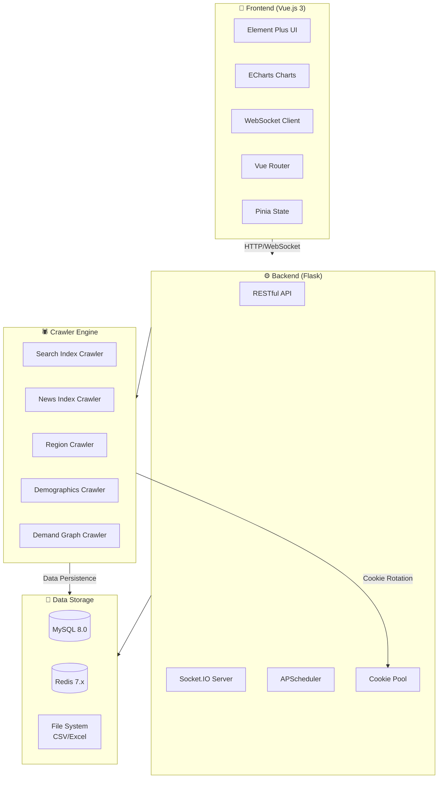
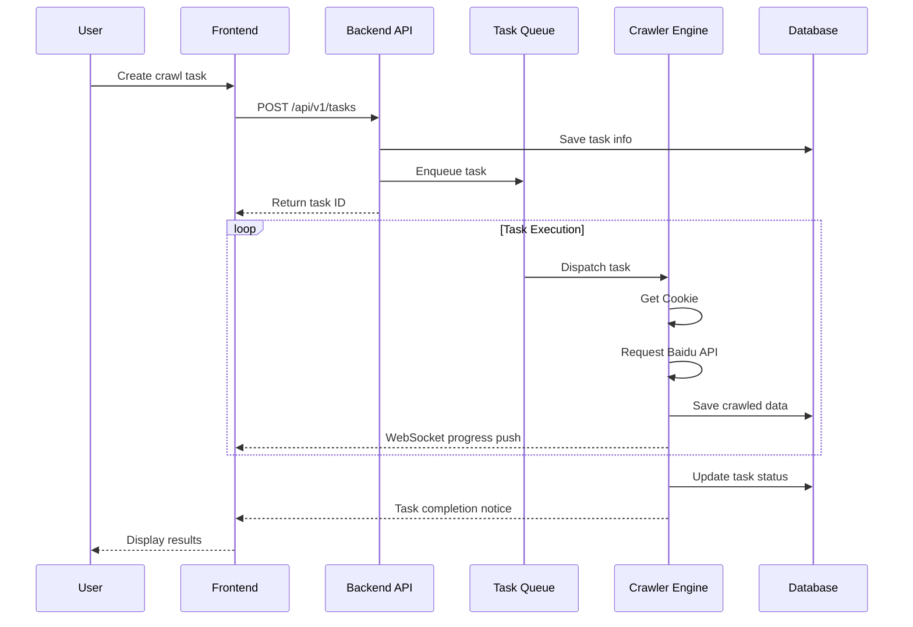

<div align="center">
  
  <h1>🎯 BaiduIndexHunter 2.0</h1>
  <p><strong>Professional Baidu Index Data Collection & Analysis Platform</strong></p>
  
</div>

<p align="center">
  <a href="./README.md">🇨🇳 简体中文</a> | <a href="./README_EN.md">🇺🇸 English</a>
</p>

<p align="center">
  
  
  
  
  
</p>

<p align="center">
  
  
  
  
  
</p>

---

## 📺 Demo Video

<p align="center">
  <a href="static/github演示视频.mp4">
    
  </a>
</p>

> 👆 Click the image above to watch the full demo video

---

## ⚠️ Disclaimer

> **This project is for educational and research purposes only. Commercial use is strictly prohibited.**
> Users must comply with applicable laws and regulations. Any legal liability arising from the use of this project is the sole responsibility of the user.

---

## 📖 Table of Contents

- [Introduction](#-introduction)
- [Features](#-features)
- [System Architecture](#-system-architecture)
- [Tech Stack](#-tech-stack)
- [Screenshots](#-screenshots)
- [Quick Start](#-quick-start)
- [Usage Examples](#-usage-examples)
- [Crawler Modules](#-crawler-modules)
- [Requirements](#-requirements)
- [Contributing](#-contributing)
- [License](#-license)
- [Contact](#-contact)
- [Star History](#-star-history)

---

## 🎯 Introduction

**BaiduIndexHunter 2.0** is a full-featured Baidu Index data collection and analysis system designed to help users efficiently obtain core data from Baidu Search, News, User Demographics, and more.

The system uses a modern **front-end and back-end separation architecture**, supporting:

- 🚀 Multi-user concurrent tasks
- 📊 Real-time monitoring & data visualization dashboard
- 🔐 Powerful Cookie pool management
- 🔄 Checkpoint recovery & auto-resume
- 🌍 Multi-language internationalization support

Whether for academic research, market analysis, or competitive research, BaiduIndexHunter provides stable and reliable data support.

---

## ✨ Features

<table>
  <tr>
    <td align="center" width="25%">
      <br>
      <strong>Six Module Coverage</strong><br>
      <sub>Search Index, News Index, Demand Graph<br>Demographics, Interest, Region</sub>
    </td>
    <td align="center" width="25%">
      <br>
      <strong>Concurrent Collection</strong><br>
      <sub>Distributed task queue<br>Multi-user support</sub>
    </td>
    <td align="center" width="25%">
      <br>
      <strong>Real-time Monitoring</strong><br>
      <sub>WebSocket push<br>Data dashboard</sub>
    </td>
    <td align="center" width="25%">
      <br>
      <strong>Smart Cookie Management</strong><br>
      <sub>Auto rotation, ban detection<br>Usage visualization</sub>
    </td>
  </tr>
  <tr>
    <td align="center">
      <br>
      <strong>Checkpoint Recovery</strong><br>
      <sub>Auto-resume on interruption<br>Persistent checkpoints</sub>
    </td>
    <td align="center">
      <br>
      <strong>Flexible Export</strong><br>
      <sub>CSV / Excel formats<br>Auto-persistence</sub>
    </td>
    <td align="center">
      <br>
      <strong>Internationalization</strong><br>
      <sub>Chinese / English UI</sub>
    </td>
    <td align="center">
      <br>
      <strong>Dark Mode</strong><br>
      <sub>Eye-friendly dark theme<br>One-click toggle</sub>
    </td>
  </tr>
</table>

---

## 🏗️ System Architecture

### Architecture Diagram



### Task Flow Diagram



---

## 🛠️ Tech Stack

### Backend

|                                                    Technology                                                    | Version | Description                 |
| :--------------------------------------------------------------------------------------------------------------: | :-----: | :-------------------------- |
|              |  3.11+  | Core programming language   |
|                 |  3.1.2  | Web API framework           |
|  |   2.0   | ORM with connection pooling |
|                 |   7.x   | Cache & message queue       |
|                 |   8.0   | Relational database         |
|        |   4.x   | Browser automation          |
|     |   5.x   | Real-time communication     |

### Frontend

|                                                     Technology                                                      | Version | Description                          |
| :-----------------------------------------------------------------------------------------------------------------: | :-----: | :----------------------------------- |
|                 |   3.4   | Frontend framework (Composition API) |
|                       |   5.1   | Build tool                           |
|  |   2.4   | UI component library                 |
|                    |   2.x   | State management                     |
|       |   5.6   | Data visualization                   |
|                    |   1.6   | HTTP client                          |

---

## 📸 Screenshots

### 🏠 Home Page

<table>
  <tr>
    <td></td>
    <td></td>
  </tr>
</table>

### 📊 Data Dashboard

<table>
  <tr>
    <td colspan="2"></td>
  </tr>
  <tr>
    <td></td>
    <td></td>
  </tr>
</table>

### 🕷️ Data Collection

<table>
  <tr>
    <td></td>
    <td></td>
  </tr>
</table>

### 🍪 Cookie Management

<table>
  <tr>
    <td></td>
    <td></td>
  </tr>
</table>

---

## 🚀 Quick Start

### 1. Clone Repository

```bash
git clone https://github.com/Auroral0810/BaiduIndexHunter.git
cd BaiduIndexHunter
```

### 2. Backend Setup

```bash
cd baidu-index-hunter-backend

# Create virtual environment
python -m venv venv
source venv/bin/activate  # Windows: venv\Scripts\activate

# Install dependencies
pip install -r requirements.txt

# Configure environment
cp config/.env.example config/.env
# Edit config/.env with your database credentials

# Initialize database
mysql -u root -p < scripts/BaiduIndexHunter.sql

# Start backend
python app.py
```

### 3. Frontend Setup

```bash
cd baidu-index-hunter-frontend

# Install dependencies
npm install

# Start development server
npm run dev

# Production build
npm run build
```

### 4. Access System

- Frontend: `http://localhost:5173`
- Backend API: `http://localhost:5001`
- API Docs: `http://localhost:5001/apidocs`

---

## 📈 Usage Examples

### Data Output Examples

#### Daily Data


#### Yearly Data


---

## 🕷️ Crawler Modules

|       Module        | Function                               | API Endpoint                      |
| :-----------------: | :------------------------------------- | :-------------------------------- |
| 🔍 **Search Index** | Daily/weekly search trends, statistics | `/api/SearchApi/index`            |
|  📰 **News Index**  | Daily/weekly news trends               | `/api/FeedSearchApi/getFeedIndex` |
| 🗺️ **Demand Graph** | Keyword associations                   | `/api/WordGraph/multi`            |
| 👥 **Demographics** | Gender, age, education distribution    | `/api/SocialApi/baseAttributes`   |
|   💡 **Interest**   | User interest profile                  | `/api/SocialApi/interest`         |
|    📍 **Region**    | Provincial/city search index           | `/api/SearchApi/region`           |

---

## 💻 Requirements

|  Software   |                 Minimum                 |  Recommended  |
| :---------: | :-------------------------------------: | :-----------: |
|   **OS**    | Windows 10 / macOS 10.15 / Ubuntu 20.04 | Latest stable |
| **Python**  |                 3.11.0                  |    3.11.13    |
| **Node.js** |                 18.0.0                  | 18.20.8 (LTS) |
|  **MySQL**  |                  8.0.0                  |    8.0.36     |
|  **Redis**  |                  7.0.0                  |     7.2.7     |
| **Chrome**  |                 Latest                  |    Latest     |

> ⚠️ **Note**: Python must be 3.11.x, 3.12+ is not yet supported

---

## 🤝 Contributing

We welcome contributions of all kinds! Please see [CONTRIBUTING.md](CONTRIBUTING.md) for details.

### How to Contribute

1. 🍴 Fork the repository
2. 🔨 Create a feature branch (`git checkout -b feature/AmazingFeature`)
3. 📝 Commit changes (`git commit -m 'Add some AmazingFeature'`)
4. 📤 Push to branch (`git push origin feature/AmazingFeature`)
5. 🎉 Open a Pull Request

---

## 📄 License

This project is licensed under the **EULA Non-Commercial License**.

- ✅ Personal learning and academic research allowed
- ✅ Non-commercial technical exchange allowed
- ❌ Commercial use prohibited

See [LICENSE](LICENSE) for details.

---

## 📞 Contact

If you have any questions or suggestions, feel free to reach out:

<table>
  <tr>
    <td align="center">
      <strong>📧 Email</strong><br>
      <a href="mailto:15968588744@163.com">15968588744@163.com</a>
    </td>
    <td align="center">
      <strong>💬 QQ</strong><br>
      1957689514<br>
      
    </td>
    <td align="center">
      <strong>💚 WeChat</strong><br>
      Scan to add<br>
      
    </td>
  </tr>
</table>

---

## ⭐ Star History

<p align="center">
  <a href="https://star-history.com/#Auroral0810/BaiduIndexHunter&Date">
    
  </a>
</p>

---

<p align="center">
  <strong>If this project helps you, please give it a ⭐ Star!</strong>
</p>

<p align="center">
  Made with ❤️ by <a href="https://github.com/Auroral0810">Auroral0810</a>
</p>
