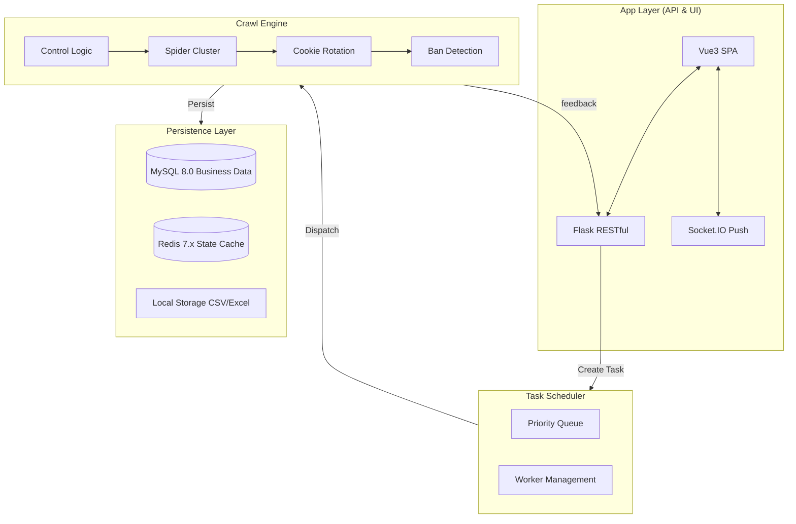

<div align="center">
  <br />
  
  <h1>🎯 BaiduIndexHunter 2.0</h1>
  <p><h3>Professional Baidu Index Data Collection & Analysis Platform</h3></p>
  
  <br />
  <br />
</div>

<p align="center">
  <a href="./README.md">🇨🇳 简体中文</a> | <a href="./README_EN.md">🇺🇸 English</a>
</p>

<p align="center">
  
  
  
  
  
</p>

<p align="center">
  
  
  
  
  
</p>

---

## 📺 Demo Video

<p align="center">
  <video src="https://github.com/Auroral0810/BaiduIndexHunter/raw/main/static/github演示视频.mp4" controls autoplay muted loop width="95%" poster="static/首页-门面.png">
    Your browser does not support HTML5 video. Please <a href="static/github演示视频.mp4">click here to download</a> and watch.
  </video>
</p>

---

## ⚠️ Disclaimer

> **This project is for educational and research purposes only. Commercial use is strictly prohibited.**
> Users must comply with applicable laws and regulations. Any legal liability arising from use is the sole responsibility of the user.

---

## 📖 Table of Contents

- [Introduction](#-introduction)
- [Key Features](#-key-features)
- [System Architecture](#-system-architecture)
- [Tech Stack](#-tech-stack)
- [Interface Highlights](#-interface-highlights)
- [Quick Start](#-quick-start)
- [Requirements](#-requirements)
- [Contact](#-contact)

---

## 🎯 Introduction

**BaiduIndexHunter 2.0** is an industrial-grade solution for Baidu Index data collection.
Built with **Flask + Vue3 + Element Plus**, it integrates distributed task scheduling, real-time status updates, intelligent anti-crawling, and a data visualization dashboard.

✅ **Core Value**: Overcomes the inefficiency of manual data entry for Baidu Index, empowering academic research and professional data analysis.

---

## ✨ Key Features

<div align="center">

| 🏷️ **Capability**           | 📝 **Detailed Description**                                                                                                   |
| :-------------------------- | :---------------------------------------------------------------------------------------------------------------------------- |
| 🔍 **Full Coverage**        | Deep integration of **Search Index**, **News Index**, **Demand Graph**, **Demographics**, **Interests**, and **Region** APIs. |
| 📊 **Real-time Monitoring** | Powered by **WebSocket**, synchronizing crawl progress and system logs in real-time.                                          |
| ⚡ **High Concurrency**     | Distributed message queue design supports multiple simultaneous tasks for massive keyword list processing.                    |
| 🍪 **Smart Account Pool**   | Automatic Cookie **rotation**, ban detection, and visual usage statistics.                                                    |
| 🔄 **Auto-Resume**          | Task checkpointing mechanism allows one-click recovery after interruptions, preventing duplicate data usage.                  |
| 📤 **Structured Export**    | Automatically cleans and exports data to **CSV / Excel / Parquet** formats with DB persistence.                               |
| 🌐 **i18n Support**         | Fully localized interface in **Chinese / English** for global usage.                                                          |
| 🌙 **Dark Mode**            | Modern aesthetic with **one-click theme switching** to reduce eye strain.                                                     |

</div>

---

## 🏗️ System Architecture

### Processing Logic



---

## 📸 Interface Highlights

### 🏛️ Console Dashboard

<div align="center">
  
  
</div>

### 📊 Data Visualization

<div align="center">
  
  <br />
  
  
</div>

---

## 🚀 Quick Start

### 1. Requirements

Ensure **Python 3.11**, **Node.js 18**, **MySQL 8**, and **Redis 7** are installed.

### 2. Backend Setup

```bash
cd baidu-index-hunter-backend
pip install -r requirements.txt
python app.py
```

### 3. Frontend Setup

```bash
cd baidu-index-hunter-frontend
npm install && npm run dev
```

---

## 💻 Software Requirements

| Software    | Minimum | Recommended |
| :---------- | :------ | :---------- |
| **Python**  | 3.11.0  | 3.11.13     |
| **Node.js** | 18.0.0  | 18.20.x     |
| **MySQL**   | 8.0.0   | 8.0.36      |
| **Redis**   | 7.0.0   | 7.2.x       |

---

## 📄 License

Licensed under **EULA Non-Commercial License**.

---

## 📞 Contact

<table align="center">
  <tr>
    <td align="center"><b>WeChat</b></td>
    <td align="center"><b>QQ (Group)</b></td>
  </tr>
  <tr>
    <td align="center"></td>
    <td align="center"></td>
  </tr>
  <tr>
    <td align="center">Scan to follow</td>
    <td align="center">QQ: 1957689514</td>
  </tr>
</table>

<p align="center">
  📧 <strong>Email:</strong> <a href="mailto:15968588744@163.com">15968588744@163.com</a>
</p>

---

<p align="center">
  <b>If this project helps you, please give it a ⭐ Star! Thank you!</b>
</p>
